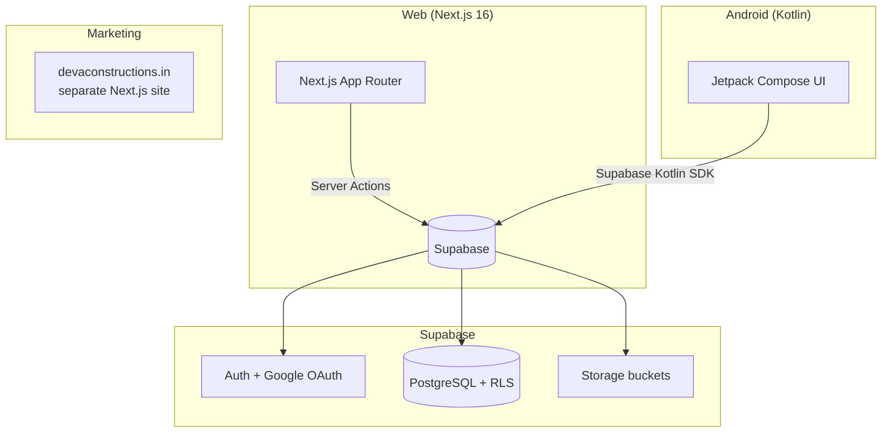

# System architecture

## Architecture

Two full-stack apps sharing a single Supabase backend:

### Web — Next.js App Router
- **Route groups**: `/admin` (staff dashboard), `/client`, `/supplier`, `/labour` — each role gets its own route tree
- **Server Actions** in `app/admin/actions.ts` and `app/supplier/actions.ts` — all mutations go through these
- **Server Components** as the default; Client Components only for interactive bits (forms, buttons with confirm dialogs)
- **`lib/guard.ts`** — `requireRole()` redirects unauthorized users at the page level
- **Tailwind CSS 3** for styling, no component library

### Android — Native Kotlin
- **Jetpack Compose** UI with Material 3
- **Supabase Kotlin SDK** talks directly to the same Postgres/Auth backend
- Mirrors every web feature: admin overview, supplier dashboard, attendance, search, reports
- Google Credential Manager for sign-in
- R8-minified release APK served from `/download`

### Supabase — The shared backend
- **Row Level Security (RLS)** is the real permission boundary — 41 migration files build up the policy set
- `is_staff()` / `is_admin()` / `current_role()` SQL functions power every RLS policy
- Auth with email+password and Google OAuth; role assigned at signup via `handle_new_user()` trigger
- Storage buckets for delivery photos and showcase images

### Key boundaries
- **Web and Android must stay at feature parity** — every feature ships on both platforms in the same pass
- **RLS is the authority**, not UI hiding — the admin layout hides nav items for managers, but the route and the database both independently enforce access
- **No API layer** — both clients talk directly to Supabase; there are no REST/GraphQL endpoints to maintain
