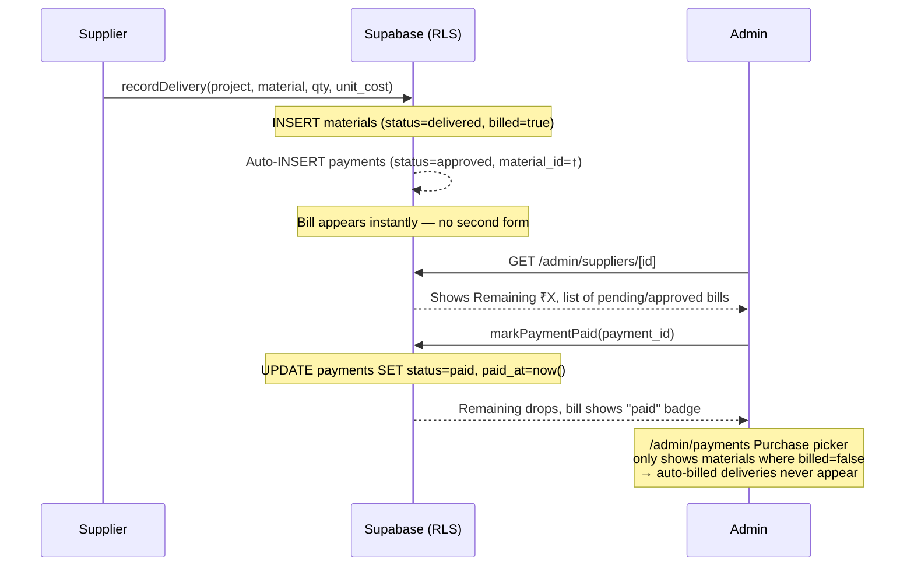

# Key flows

## Flow — Supplier delivery to payment

The most important end-to-end path: a supplier delivers materials, and the money shows up on the admin's books.

### Other key flows
- **Attendance → wage accrual**: staff marks attendance (present/half_day/absent) → `wageForStatus()` computes daily wage → accrued wages show on overview and reports
- **Client project visibility**: client signs in → RLS filters to projects where `client_id` matches → client sees progress, materials, payments on their own sites
- **Admin approval chain**: supplier bill lands as `approved` (auto) → admin marks paid → payment moves to `paid` status → shows in cash flow and P&L
- **Backup**: GitHub Actions cron → hits Supabase API → exports all tables to Excel → commits to repo → prunes old backups
