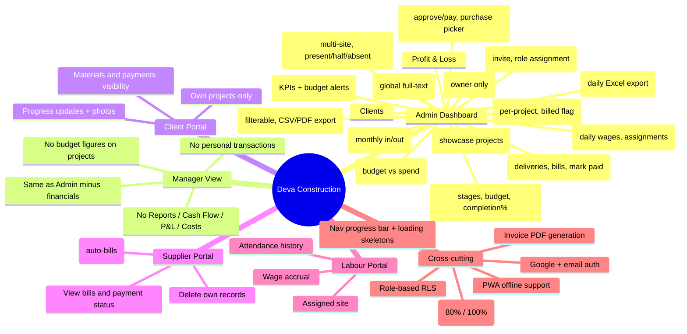

# Feature mindmap

## Mindmap — Feature landscape

```mermaid
mindmap
  root((Deva Construction))
    Admin Dashboard
      Overview (KPIs + budget alerts)
      Projects (stages, budget, completion%)
      Clients
      Suppliers (deliveries, bills, mark paid)
      Labour (daily wages, assignments)
      Materials (per-project, billed flag)
      Payments (approve/pay, purchase picker)
      Attendance (multi-site, present/half/absent)
      Reports (filterable, CSV/PDF export)
      Cash Flow (monthly in/out)
      Profit & Loss
      Cost Tracking (budget vs spend)
      Search (global full-text)
      Team Access (invite, role assignment)
      Backup (daily Excel export)
      Personal Transactions (owner only)
      Website Management (showcase projects)
    Manager View
      Same as Admin minus financials
      No Reports / Cash Flow / P&L / Costs
      No personal transactions
      No budget figures on projects
    Client Portal
      Own projects only
      Progress updates + photos
      Materials and payments visibility
    Supplier Portal
      Record deliveries (auto-bills)
      View bills and payment status
      Delete own records
    Labour Portal
      Attendance history
      Wage accrual
      Assigned site
    Cross-cutting
      Google + email auth
      Role-based RLS
      PWA offline support
      Invoice PDF generation
      Budget alerts (80% / 100%)
      Nav progress bar + loading skeletons
```
