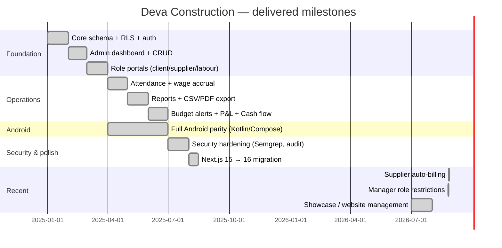

# Roadmap

## Roadmap

```mermaid
gantt
    title Deva Construction — delivered milestones
    dateFormat YYYY-MM-DD
    section Foundation
    Core schema + RLS + auth              :done, 2025-01-01, 2025-02-01
    Admin dashboard + CRUD                :done, 2025-02-01, 2025-03-01
    Role portals (client/supplier/labour) :done, 2025-03-01, 2025-04-01
    section Operations
    Attendance + wage accrual             :done, 2025-04-01, 2025-05-01
    Reports + CSV/PDF export              :done, 2025-05-01, 2025-06-01
    Budget alerts + P&L + Cash flow       :done, 2025-06-01, 2025-07-01
    section Android
    Full Android parity (Kotlin/Compose)  :done, 2025-04-01, 2025-07-01
    section Security & polish
    Security hardening (Semgrep, audit)   :done, 2025-07-01, 2025-08-01
    Next.js 15 → 16 migration             :done, 2025-08-01, 2025-08-15
    section Recent
    Supplier auto-billing                 :done, 2026-08-26, 1d
    Manager role restrictions             :done, 2026-08-25, 1d
    Showcase / website management         :done, 2026-07-01, 2026-08-01
```

> **Note**: Exact dates are approximate — reconstructed from git history. The gantt shows the order and rough timeline of major capability drops.
