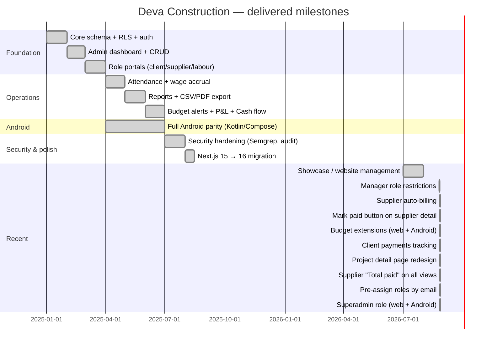

# Roadmap

## Roadmap

> **Note**: Exact dates are approximate — reconstructed from git history. The gantt shows the order and rough timeline of major capability drops.

All SQL migrations (up to 44) have been applied to production as of 2026-08-26.

### Known pending work

- **Android: Mark paid button on supplier detail** — web has it, Android supplier detail still shows read-only Pending/Received pair
- **Android: Client payments on project detail** — web shows client payment history on the project page, Android doesn't yet
- **Android: Project detail page redesign** — web got a hero + two-column layout, Android still has the old flat layout
